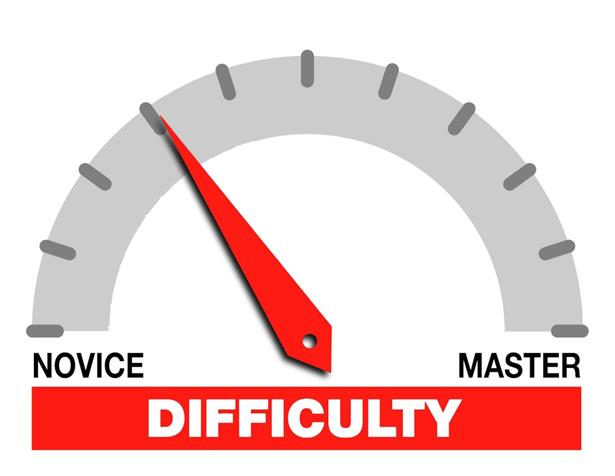

First Impressions of TypeScript: A New Journey
As someone new to TypeScript, I have found it to be a refreshing and powerful addition to my programming toolkit. TypeScript, developed by Microsoft, is a superset of JavaScript that introduces static typing, which has significantly enhanced my development experience. Here, I will share my initial impressions of TypeScript and compare it to other programming languages I have encountered.

Discovering Static Typing
One of the most striking features of TypeScript is its static typing. Unlike JavaScript, where types are determined at runtime, TypeScript allows me to define types explicitly. This has been a game-changer for me, as it enables the compiler to catch type-related errors during development, reducing the likelihood of runtime errors. This feature is reminiscent of statically-typed languages like Java and C#, which also emphasize type safety and early error detection.

Enhanced Development Experience
TypeScript’s static typing and type inference capabilities have significantly improved my development experience. The enhanced tooling and IDE support, such as autocompletion, refactoring, and navigation, make coding more efficient and enjoyable. This level of support is comparable to what I have experienced with languages like Java and C#, where robust development environments are the norm.

Seamless Transition from JavaScript
One of the aspects I appreciate most about TypeScript is its compatibility with JavaScript. Since TypeScript is a superset of JavaScript, any valid JavaScript code is also valid TypeScript code. This compatibility has made the transition smooth and painless. I can gradually introduce TypeScript into existing JavaScript projects, allowing for a flexible and incremental adoption process.

Advanced Language Features
TypeScript introduces several advanced language features that have enhanced my coding capabilities. These include:

Interfaces and Type Aliases: These allow me to define custom types and enforce contracts within my code, improving readability and maintainability.
Generics: Generics enable the creation of reusable and type-safe components, making my code more modular and flexible.
Decorators: Decorators provide a way to add metadata to classes and methods, similar to annotations in Java or attributes in C#, adding a layer of functionality and organization to my code.
These features make TypeScript more expressive and powerful, akin to languages like Java and C#.

Learning Curve and Adaptation
As someone coming from dynamically-typed languages like JavaScript and Python, adapting to TypeScript’s static typing introduced a learning curve. However, the benefits of early error detection and improved code quality have made the effort worthwhile. Developers with experience in statically-typed languages like Java or C# may find TypeScript more intuitive and easier to adopt.

Community and Ecosystem
TypeScript boasts a rapidly growing community and a rich ecosystem of libraries and frameworks. Popular frameworks like Angular are built with TypeScript, and many other libraries offer TypeScript type definitions. This widespread adoption and community support have made TypeScript a strong contender in the modern web development landscape.

Conclusion
In conclusion, my first impressions of TypeScript have been overwhelmingly positive. Its combination of static typing, enhanced tooling, advanced language features, and compatibility with JavaScript make it a valuable addition to any developer’s toolkit. While it may introduce a learning curve, the long-term benefits of improved code quality and maintainability make TypeScript a worthwhile investment. As I continue to explore and learn more about TypeScript, I am excited about the possibilities it offers for building robust and scalable applications.
